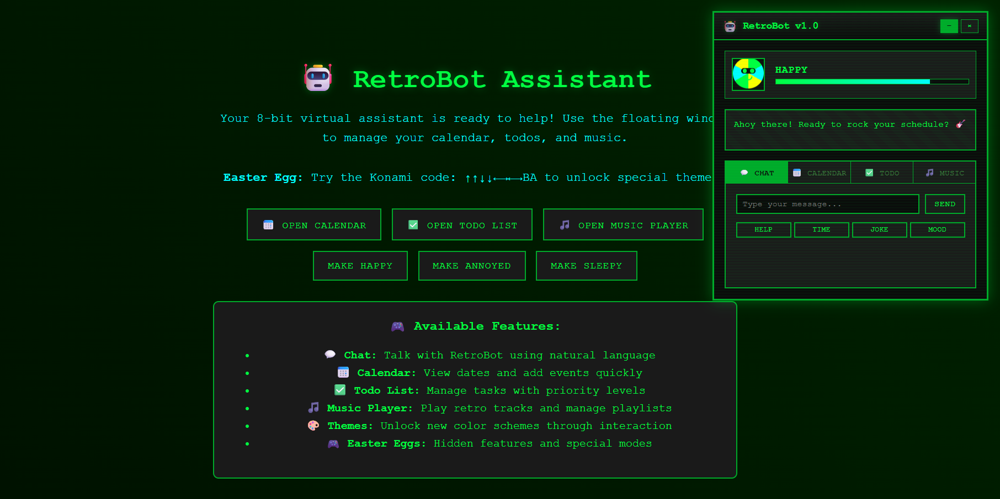

---

# 🕹️ RetroBot — Your 8-Bit Browser Assistant

RetroBot is a pixelated, moody virtual assistant built for your browser — think Clippy meets a Nintendo cartridge.  
It lives in a draggable window, speaks in sassy retro dialogue, and helps you manage your **Todo list**, **Calendar**, and **Music** — all while looking cool in glorious 8-bit style.

---

## 🎮 Features

- 🎤 **8-Bit Personality**  
  RetroBot talks to you with pixel-perfect sass and has dynamic moods: Happy, Sleepy, and Annoyed.

- ✅ **Todo List Manager**  
  Add, track, and manage tasks with a few nostalgic clicks.

- 📅 **Mini Calendar**  
  Schedule events using a classic date picker and view saved reminders.

- 🎵 **Music Player**  
  Plays retro tunes using the built-in `<audio>` player. Easily swappable with your own MP3 files.

- 🧠 **Modular Architecture**  
  Toggle modules (todo/calendar/music) independently — more modules can be added easily.

- 💾 **Data Persistence (WIP)**  
  Designed to persist your tasks and mood using `localStorage`.

---

## 🛠️ Tech Stack

- HTML5 / CSS3 (Retro UI via pixel classes)
- Vanilla JavaScript (No frameworks)
- Sprite-ready UI design (NES/DOS vibes)
- Mobile-responsive layout planned

---

## 🚀 Getting Started

### 1. Clone the Repository

```bash
git clone https://github.com/nitinyadav2188/RetroBot.git
cd RetroBot
```

### 2. Open the App

Just open `index.html` in your favorite browser — no build required!

---

## 🎨 Customize Your Bot

- 🎭 **Change Personality Script:**  
  Edit `bot.js` to tweak how RetroBot talks depending on mood.

- 🧱 **Add Sprites & Sounds:**  
  Drop new assets into `/assets` or `/music` folders and modify paths in HTML.

- 🧩 **Add New Modules:**  
  Use the `toggleModule()` logic and follow the structure in the HTML to add more tools!

---

## 🧪 Coming Soon

- Mood-tracking based on user actions  
- CRT screen filter effect  
- Save todos/events using `localStorage`  
- Retro game unlock Easter eggs (Konami code?)

---

## 🤓 License

MIT — free to fork, remix, and make your own 8-bit assistant!

---

## ✨ Retro is the Future

RetroBot isn’t just a productivity tool — it’s a nostalgic companion built to bring fun into your daily routine.

> “Hey you! Don’t just stand there. Add a task already. 😤”
